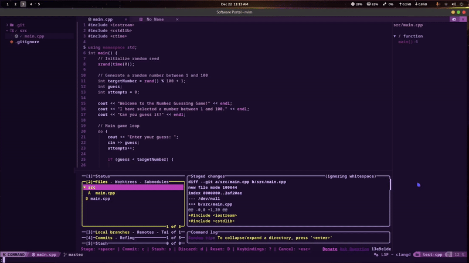

# telescope-meson.nvim

An extension for [telescope.nvim](https://github.com/nvim-telescope/telescope.nvim)
that provides meson support to neovim

## Demo



## Requirements

- [telescope.nvim](https://github.com/nvim-telescope/telescope.nvim) (required)

## Installation

### Lazy.nvim

```lua
{
  "NEOLabs-software/telescope-meson.nvim",
  lazy = true,
  config = function()
       require('telescope-meson.meson_picker').setup() 
  end
}

```

### packer.nvim

```lua
use {
    'NEOLabs-software/telescope-meson.nvim',
    requires = {
        'nvim-telescope/telescope.nvim',
    },
    config = function()
      require('telescope-meson.meson_picker').setup()  
    end
}
```

### vimplug

```vim
Plug 'NEOLabs-software/telescope-meson.nvim'
```

## Setup

if you are not using lazy or packer, then you can add this line into init.lua

```lua
require('telescope-meson.meson_picker').setup()  
```

if you are lazyloading, then calling the setup function is not needed, but tab-completion will not be Available

## Available setup settings:

this is the default config for telescope-meson

```lua
require('telescope-meson.meson_picker').setup({
  builddir_name = '/builddir', -- Default builddir name
  meson_build_name = '/meson.build', -- Default meson.build file name
  meson_commands_with_builddir = {
    "meson compile -C %s",
    "meson test -C %s",
    "meson install -C %s",
    "meson configure -C %s",
    "meson clean -C %s"
  }, -- Commands with builddir
  meson_commands_without_builddir = {
    "meson setup %s",
    "meson compile -C %s",
    "meson test -C %s",
    "meson install -C %s",
    "meson configure -C %s",
    "meson clean -C %s"
  }, -- Commands without builddir
  meson_build_template = [[
project('%s', 'c', 'cpp',
  default_options : ['buildtype=release', 'warning_level=2'])

executable('%s', %s)
]], -- Default meson.build template

})  
```

> note: the %s represents the builddir variable, it is crucial for the plugin to work properly

explanation:
| setting | meaning | default value |
| ------------- | -------------- | -------------- |
| builddir_name | this tells the plugin what the name of the build directory is | /builddir |
| meson_build_name | this is the name of the meson.build file **NOTE: not recommended to change** | /meson.build |
| meson_commands_with_builddir | this is the command list when the build directory is present | found in config |
| meson_commands_without_builddir | just like meson_commands_with_builddir but when build directory is not present | found in config |
| meson_build_template | this is what the default meson.build file will look like when you start a new meson project | found in config |


# credits

**created by NEOLabs-software**


